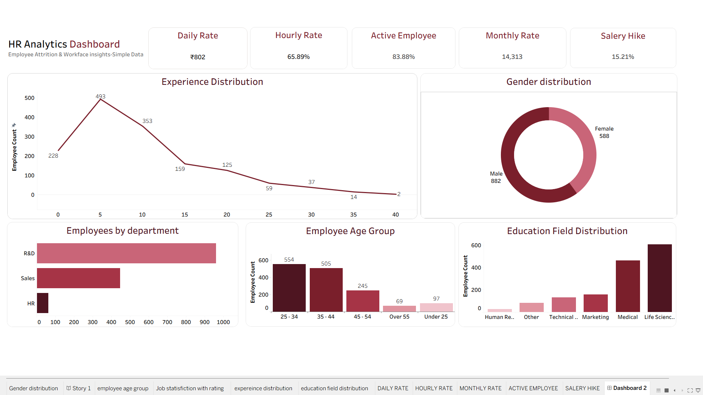

# 👨‍💼 HR Analytics Dashboard

An interactive HR Analytics Dashboard developed using Power BI to help HR teams monitor workforce performance, employee demographics, attrition trends, recruitment metrics, and overall organizational insights.

---

# 📌 Project Overview

This dashboard transforms raw HR data into meaningful insights through interactive visualizations. It helps HR managers and business leaders make data-driven decisions regarding employee management, retention, and workforce planning.

---

# 🎯 Objectives

- Analyze employee demographics
- Monitor employee attrition
- Evaluate department-wise performance
- Track recruitment and hiring trends
- Identify workforce distribution
- Support strategic HR decision-making

---

# 📊 Dashboard Features

### 📌 KPI Cards

- Total Employees
- Active Employees
- Attrition Count
- Attrition Rate
- Average Age
- Average Salary

---

### 📈 Visualizations

- Employee Distribution by Department
- Gender Distribution
- Age Group Analysis
- Education Level Analysis
- Job Role Distribution
- Attrition by Department
- Attrition by Gender
- Attrition by Age Group
- Salary Analysis
- Years at Company
- Performance Rating Analysis

---

# 🎛 Interactive Filters

- Department
- Gender
- Education
- Job Role
- Marital Status
- Age Group

---

# 🛠 Tools Used

- Power BI
- Microsoft Excel
- Power Query
- DAX

---

# 📂 Dataset Information

The dataset contains employee-related information including:

- Employee ID
- Age
- Gender
- Department
- Job Role
- Education
- Marital Status
- Salary
- Years at Company
- Performance Rating
- Attrition
- Overtime

---

# 💡 Key Business Insights

- Identify departments with the highest attrition.
- Compare employee distribution across departments.
- Analyze salary trends among job roles.
- Understand workforce demographics.
- Track employee retention patterns.
- Support HR planning using data-driven insights.

---

# 📷 Dashboard Preview

## Main Dashboard



```text
Images/Dashboard.png
```

---

# 📁 Project Structure

```
HR-Analytics-Dashboard
│
├── Dashboard
├── Data
├── Documentation
├── Images
├── Assets
└── README.md
```

---

# 🚀 How to Run

1. Clone this repository.
2. Open the `.pbix` file using Power BI Desktop.
3. Refresh the dataset if required.
4. Explore the dashboard using filters and slicers.

---

# 📌 Future Improvements

- Live SQL Database Integration
- Automated Data Refresh
- Predictive Attrition Analysis
- HR KPI Forecasting
- Employee Performance Prediction

---

# 👩‍💻 Author

**Jasmeen Sharma**

🎓 BCA Student

📊 Aspiring Data Analyst

---

⭐ If you found this project useful, don't forget to star this repository.
